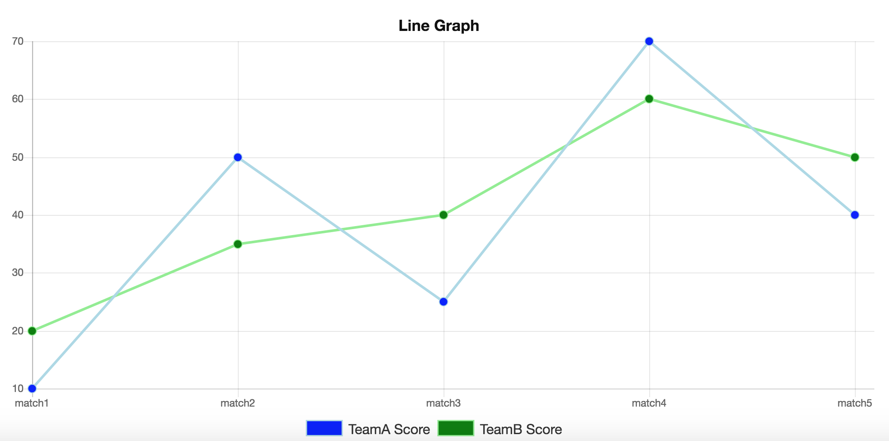
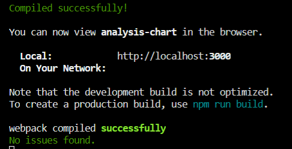

# Analysis Chart



Analysis Chart is a simple project for rendering country, camp and schools data on a chart:

#### Live Demo For the Project on vercel:

[](http://analysis-chart-vois.vercel.app/)

## Technologies used

-   [Reactjs](https://reactjs.org/)
-   [TypeScript](https://www.typescriptlang.org/)
-   [Redux Tookit](https://redux-toolkit.js.org/)
-   [Chartjs](https://www.chartjs.org/)
-   [TailWind-Css](https://tailwindcss.com/)
-   [Cypress](https://www.cypress.io/)
-   [Sass](https://sass-lang.com/)
-   [React Hook Form](https://react-hook-form.com/)
-   [i18next](https://www.i18next.com/)

## Getting started

-   First Clone the repo:

```shell
git clone https://github.com/markosbahgat/Analysis-Chart.git
```

-   Second Install the dependencies:

```shell
npm install
```

-   it's time to start the server:

```shell
npm start
```

Now you should see a message in the terminal like this one:


## Feature set

This project is still in early phase, so i have many features that i can implement soon! [This demo](https://www.youtube.com/watch?v=X_zp6CodHjc&t=493s) covers a majority of features supported in this project.

| Feature                                                                           | Status |
| --------------------------------------------------------------------------------- | ------ |
| Very Basic Authntication (Sign In Form)                                           | ✅     |
| Light Mode and Dark Mode                                                          | ✅     |
| Multi lingual Support (Arabic and English)                                        | ✅     |
| E2E Testing                                                                       | ✅     |
| Complete Dashboard UI                                                             | ✅     |
| Chart That renders data coming from `data.json` file                              | ✅     |
| Useing Local Storage to store data like (user-token, filters, current Lang..etc ) | ✅     |
| Single Source of Truth (Redux Store)                                              | ✅     |
| Using TypeScript For Type Checking                                                | ✅     |
| Clean Code and Reusable Components approach are applied to the code               | ✅     |

## Project Preview (On Youtube)

#### Click me 👇

[](https://youtu.be/ts8ek-UfyYc)

## Reach out for Markos Bahgat

[](https://twitter.com/bahgat_markos)

> [_Portofolio Website_](https://markosbahgat.com)  
> [_LinkedIn Profile_](https://www.linkedin.com/in/markos-bahgat-9a7178216)  
> [_Phone Number Or WhatsApp_]() : ` +201208444364`
> Analysis Chart is a simple project for rendering country, camp and schools data on a chart:
